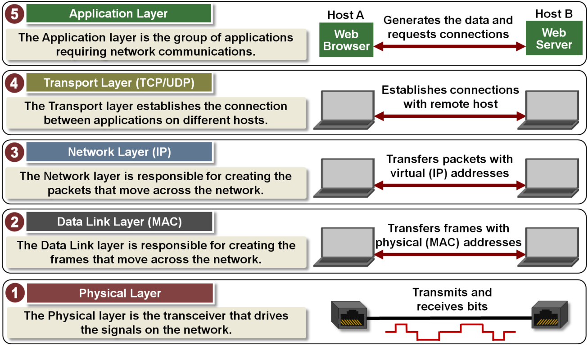
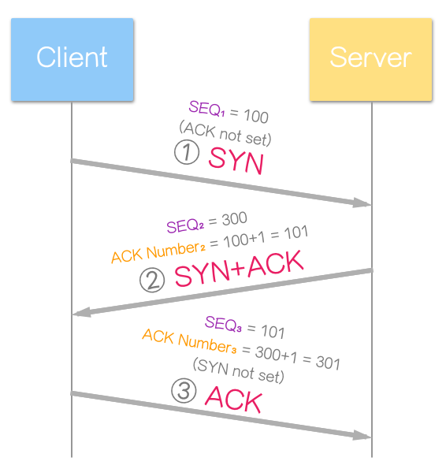
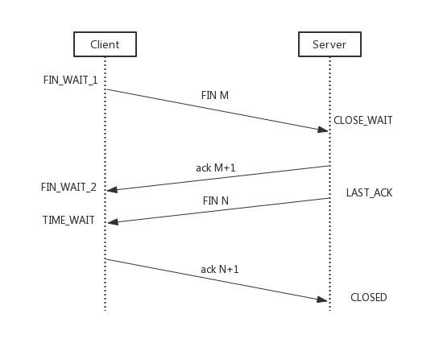
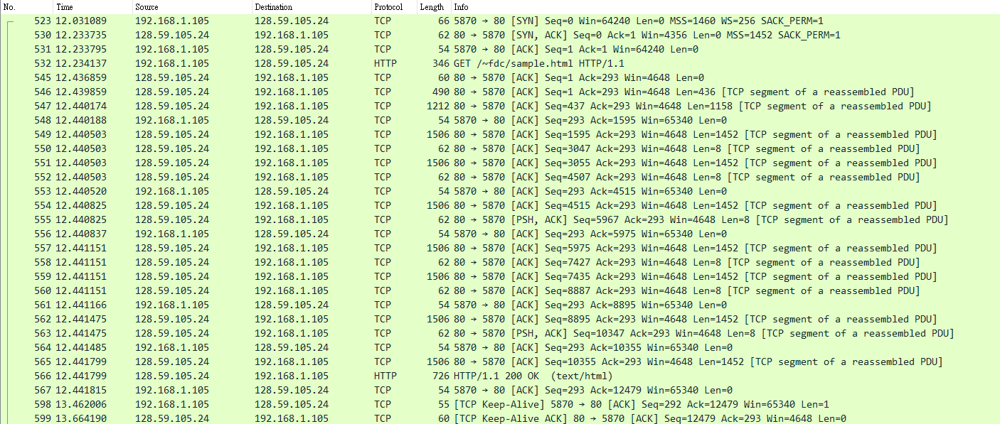
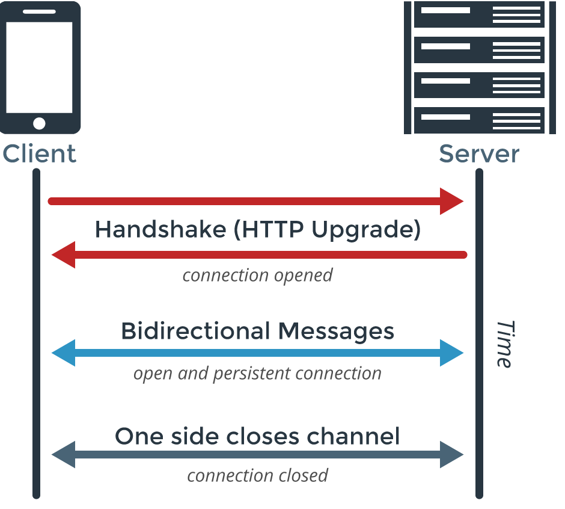

# Internet Protocol

1. TCP/IP 五層模型

    - 網路的實現分為好幾層，每一層都會有自己的功能，用戶接觸的是最上面的那層，根本沒有感覺到下層的存在，Client 與 Server 的資料交換實際上都包含這五層協定，這五層都是為了完成某一種功能而存在，為了實現這些功能需要大家遵守共同的規則，大家都遵守共同的規則稱為協定，網路的核心實際上就是一系列的協定交換，總稱為 Internet Protocol suite ( IPS )

        

        - Application Layer: 應用層，封包最終會組成以下格式進行傳輸，由於網路是開放的架構，資料格式若沒有約定好根本就無法解讀，如: WWW, E-MAIL, FTP...等需要網路通信功能所在的地方，必須有不同協定規定網頁、電子郵件還是 FTP 的格式，這些協定所構成的就是應用層，也是大多數使用者、開發者會接觸到的部分

            |Data Link header|Network header|Transport header|Appl. Data...|
            |-|-|-|-|

            - 一般而言，若需使用網路服務，需要有以下四組設定，通常不會自行設定靜態 IP Address，而是採用自動設定的動態 IP Address

                |IP Address|Subnet MASK|Default Gateway|DNS Server|
                |-|-|-|-|

                - Dynamic Host Configuration Protocol ( DHCP ): 動態 IP Address 在開機後會自動分配一個 IP Address，而他所使用的協定就是 DHCP，DHCP 是建立在 UDP 之上的應用層協定，規定每個子網路中會有一台主機( DHCP Server )專門負責網路內的所有 IP Address，所有加入子網路的主機都必須向 DHCP Server 發送請求申請 IP Address 和相關的參數，由於新加入的主機無法得知 DHCP Server 的 IP Address 和 MAC Address，新主機發出的請求可以填入下表預設值用 Broadcast 的方式發送 DHCP 封包到 DHCP Server，DHCP Server 收到後會將上述的四組設定塞到 Data 中回傳，新主機確定 IP 沒有被占用後就可以開始上網了

                    ||Data Link header|Network header|Transport header|Appl. Data...|
                    |-|-|-|-|-|
                    ||MAC Address|IP Address|Port||
                    |發送方|{Own MAC Address}|0.0.0.0|68||
                    |接收方|FF:FF:FF:FF:FF:FF|255.255.255.255|67||

                - DNS Protocol: DNS 也是建立在 UDP 之上的應用層協定，網路連接需要對方的 IP Address，一般而已我們使用的是網址，所以必須向 DNS Server ( Port 53 ) 發送 DNS 封包請求正確的 IP Address，收到 IP Address 後就能透過 MASK 進行 AND 計算判斷兩方是否在同個子網路，以確認是要透過 Gateway 還是 ARP 來進行溝通

        - Transport Layer ( TCP/UDP ): 傳輸層，當確定了主機與 Port 就能建立程式之間的交流，使用的協定可能是較可靠的 TCP 連接、較快速的 UDP 連接...etc

            - Port: 使用網路的程式的編號，每一個封包都會發送到主機的特定 Port，以此讓不同應用取得自己所需要的封包，Port 號為 0-65535 的整數共 16 bits，0-1023 會分配給固定的服務而被系統占用，所以本地啟動 80 或 443 port 時，有時候會提示權限不足，用戶一般只能選擇 1024 以上的 Port，在瀏覽網頁或通訊軟體時，程序會隨機選用一個 Port 與伺服器的相應 Port 做聯繫

            - UDP: 由 Header 與 Data 組成，Header 部分只有 8 octets，總長度不超過 16 bits，發送封包之前不需建立連接，有較好的實時性，適用於高速傳輸或廣播通信，支援點對點、一對多、廣播等方式交互通信，此協定優點為簡單易實現，缺點為可靠性較差，封包發出後不能確定對方是否收到

                <table>
                    <thead>
                        <tr align="center">
                            <td colspan="5">UDP Datagram Header Format</td>
                        </tr>
                    </thead>
                    <tbody>
                        <tr align="center">
                            <td>Bit</td>
                            <td>0 ... 7</td>
                            <td>8 ... 15</td>
                            <td>16 ... 23</td>
                            <td>24 ... 31</td>
                        </tr>
                        <tr align="center">
                            <td>0</td>
                            <td colspan="2">Source Port</td>
                            <td colspan="2">Destination Port</td>
                        </tr>
                        <tr align="center">
                            <td>32</td>
                            <td colspan="2">Length</td>
                            <td colspan="2">Header and Data Checksum</td>
                        </tr>
                    </tbody>
                </table>

            - TCP: TCP 是點對點的全雙向連接，可以理解為有確認機制的 UDP 協定，每發出一個封包都要進行確認，通過 TCP 傳輸的封包不會丟失也不會重複，且能按順序到達，當丟包時會進行重發，也能對順序亂掉的封包進行順序控制，缺點是過程複雜，實現較困難且消耗資源，TCP 封包理論上沒有長度限制，但為了保證網路效益，通常 TCP 封包不會超過 IP 封包的長度，以確保 TCP 封包不會再分割
            
                <table>
                    <thead>
                        <tr align="center">
                            <td colspan="6">TCP Segment Header Format</td>
                        </tr>
                    </thead>
                    <tbody>
                        <tr align="center">
                            <td>Bit</td>
                            <td colspan="2">0 ... 7</td>
                            <td>8 ... 15</td>
                            <td>16 ... 23</td>
                            <td>24 ... 31</td>
                        </tr>
                        <tr align="center">
                            <td>0</td>
                            <td colspan="3">Source Port</td>
                            <td colspan="2">Destination Port</td>
                        </tr>
                        <tr align="center">
                            <td>32</td>
                            <td colspan="5">Sequence Number</td>
                        </tr>
                        <tr align="center">
                            <td>64</td>
                            <td colspan="5">Acknowledgment Number</td>
                        </tr>
                        <tr align="center">
                            <td>96</td>
                            <td>Data Offset</td>
                            <td>Res</td>
                            <td>Flags</td>
                            <td colspan="2">Window Size</td>
                        </tr>
                        <tr align="center">
                            <td>128</td>
                            <td colspan="3">Header and Data Checksum</td>
                            <td colspan="2">Urgent Pointer</td>
                        </tr>
                        <tr align="center">
                            <td>160...</td>
                            <td colspan="5">Options</td>
                        </tr>
                    </tbody>
                </table>

                - TCP 使用以下機制來確保可靠的傳輸

                    - Checksum: 較驗和

                    - Acknowledge (ACK): 應答確認

                    - Retransmission (PAR): 重傳控制

                    - Sequence Number (SEQ): 序號標示

                    - Flow Control ( Sliding Window ): 流量控制

                - Three-way handshake ( 握手 ): TCP 是一種連接導向 ( Connection Oriented ) 的通訊協定，所謂連線導向，是指在封包傳送之前，必須先經過與對方建立連線的動作，當建立連線成功後，才能開始傳送資料給對方，handshake 是其建立虛擬連線 ( Virtual Connection ) 的方式，其中 SYN、ACK 是 TCP 封包中的控制位元 ( Control Bits )，過程中省略了其他封包內容

                    

                    - TCP Flags ( 0 or 1 )

                        - SYN ( Synchronous ): 用於建立連接和使序列號同步

                        - ACK ( Acknowledgement ): 表示確認號欄位有效

                        - FIN ( Finish ): 表示傳送方沒有資料要傳輸了

                        - PSH ( Push )

                        - RST ( Reset )

                        - URG ( Urgent )

                    

                    - Sequence Number: 序列號，由發送端隨機選擇一個初始序號( ISN )，目的是要確定被分割過的資料的先後順序，初始序號通常會由 0 開始

                    - Acknowledgment Number: 確認碼，為了確定接收端有正確的收到資料，會將收到的 SYN 加上 TCP Segment ( 資料區段或者說是 TPC 封包 ) 的資料長度 ( Length )，回覆給發送端，由於握手時還沒有應用層的資料，此時的 ACK Number 為  SEQ + 1


                - Four-way handshake ( 揮手 ): 由於 TCP 連接是全雙向的溝通，因此每個方向都必須要單獨進行關閉，發送 FIN 表示終止這一方向的連接，接收方收到 FIN 就意味著不會再收到封包，但此時接收方的 TCP 連接仍然能夠發送資料，直到接收方也發送 FIN 為止

                    
                
                
        - Network Layer ( IP ): 網路層，主機到主機的通訊，建立網路中傳輸的 Packet，添加 IP Address 資訊分辨來源和目的地

            - Internet Protocol Address: 網路是由許多的子網路所構成，運用 ARP 協定向所有網路上的使用者發送資料顯然不合理，當兩台主機在同個子網路中時才使用 Broadcast 的方式發送，否則則採用 Router  的方式，而 MAC Address 只與廠商有關，無法用來識別不同的子網路，而 Network Layer 引進了網路地址，用以識別不同的電腦是否在同個子網內，而 IP 就是規定網路地址的協定
                
                - IPv4: 由 32 個 2 進位組成，常用 4 組 10 進位的數字表示，範圍從 0.0.0.0-255.255.255.255，例如有一組 IP 192.168.0.1，假設前 3 組數字代表網路，最後 1 組代表主機，則同一個子網的電腦前三組數字必然是相同的

                - SUBNET MASK: 單從 IP Address 是沒法判斷網路的部分到底是 24 位還是 16 位，所以用 MASK 來表示子網路特徵，在形式上類似 IP Address，但網路部分都是 1，主機部分都是 0，以上面的例子來看就是 255.255.255.0，要判斷任意兩個 IP 是否在同個子網路，只要將 IP 與 MASK 進行 AND 計算，再比較兩個數字是否相同即可

                - Packet: 由 Header 與 Data 組成，Total length 最大 16 bits，也就是 65535 octets，由於 Ethernet 的最大傳輸單元( MTU )只有 1500 octets，所以當 Packet 超過 1500 octets，就需要分割成多個 Ethernet 的 Frame 分開發送

                    - Header: 20-60 octets，包含版本號，長度，IP Address 等資訊

                        <table>
                            <thead>
                                <tr align="center">
                                    <td colspan="10">IPv4 Packet Header Format</td>
                                </tr>
                            </thead>
                            <tbody>
                                <tr align="center">
                                    <td>Offsets</td>
                                    <td>Octet</td>
                                    <td colspan="2">0</td>
                                    <td colspan="2">1</td>
                                    <td colspan="2">2</td>
                                    <td colspan="2">3</td>
                                </tr>
                                <tr align="center">
                                    <td>Octet</td>
                                    <td>Bit</td>
                                    <td colspan="2">0 ... 7</td>
                                    <td colspan="2">8 ... 15</td>
                                    <td colspan="2">16 ... 23</td>
                                    <td colspan="2">24 ... 31</td>
                                </tr>
                                <tr align="center">
                                    <td>0</td>
                                    <td>0</td>
                                    <td>Version</td>
                                    <td>IHL</td>
                                    <td>DSCP</td>
                                    <td>ECN</td>
                                    <td colspan="4">Total Length</td>
                                </tr>
                                <tr align="center">
                                    <td>4</td>
                                    <td>32</td>
                                    <td colspan="4">Identification</td>
                                    <td>Flags</td>
                                    <td colspan="3">Fragment Offset</td>
                                </tr>
                                <tr align="center">
                                    <td>8</td>
                                    <td>64</td>
                                    <td colspan="2">Time To Live</td>
                                    <td colspan="2">Protocol</td>
                                    <td colspan="4">Header Checksum</td>
                                </tr>
                                <tr align="center">
                                    <td>12</td>
                                    <td>96</td>
                                    <td colspan="8">Source IP Address</td>
                                </tr>
                                <tr align="center">
                                    <td>16</td>
                                    <td>128</td>
                                    <td colspan="8">Destination IP Address</td>
                                </tr>
                                <tr align="center">
                                    <td>20</td>
                                    <td>160</td>
                                    <td colspan="8" rowspan="3">Options (if IHL > 5)</td>
                                </tr>
                                <tr align="center">
                                    <td>...</td>
                                    <td>...</td>
                                </tr>
                                <tr align="center">
                                    <td>60</td>
                                    <td>480</td>
                                </tr>
                            </tbody>
                        </table>
                    
                    - Data: 資料的具體內容

        - Data Link Layer ( MAC ): 資料連接層，使用 Frame 封裝 Packet，並添加來源和目的地的 MAC Address 等資訊，Wifi ( 802.11 ) 與 Ethernet ( 802.3 ) 封裝格式不同
            
            - Ethernet Protocol: 實體網路只傳送 0 和 1，單純的傳輸 0 和 1 沒有意義，Ethernet protocol 定義了 0 和 1 的分組方式，一組信號構成的資料稱為 Frame，每個 Frame 分為 Header、Data、CRC Checksum
                
                <table>
                    <thead>
                        <tr align="center">
                            <td colspan="8">Ethernet ( 802.3 ) Frame Format</td>
                        </tr>
                    </thead>
                    <tbody>
                        <tr align="center">
                            <td>7 octets</td>
                            <td>1 octet</td>
                            <td>6 octets</td>
                            <td>6 octets</td>
                            <td>2 octets</td>
                            <td>42-1500 octets</td>
                            <td>4 octets</td>
                            <td>12 octets</td>
                        </tr>
                        <tr align="center">
                            <td>Preamble</td>
                            <td>Start of Frame Delimiter</td>
                            <td>Destination MAC Address</td>
                            <td>Source MAC Address</td>
                            <td>Type</td>
                            <td>Data</td>
                            <td>CRC</td>
                            <td>Inter-frame gap</td>
                        </tr>
                    </tbody>
                </table>

                - Header: 14 octets，說明發送者、接收者、資料類型...etc

                - Data: 48-1500 octets，資料傳送具體內容，也就是 Packet

                - CRC Checksum: 4 octets，檢查資料是否損壞

            - MAC Address: 所有連接網路的設備都有一組獨一無二的 MAC Address，由 48 個 2 進位組成，使用 12 個 16 進位數字表示，前 6 碼為廠商編號，後 6 碼為廠商流水號

            - Address Resolution Protocol: 傳輸資料需要對方的 MAC Address，當兩台主機位於同個子網路時，會透過 Broadcast 的方式發出 ARP Request，若不知道對方的 MAC Address，則使用一組臨時的 16 進位地址 ( FF:FF:FF:FF:FF:FF ) 發送 Broadcast，子網路中所有主機都會收到，當擁有目標 ip 的主機收到後會進行回覆，回覆中包含 MAC Address，查詢方則 Cache 在 ARP Table 中，不相關的主機則丟棄此封包

            - Gateway: 若兩台主機不在同一個子網路內，發送方需要透過 Gateway (A) 進行轉發，此時所使用的接收方 MAC Address 會改成 Gateway (A) 的 MAC Address，而 Gateway (A) 透過 Routing protocol 尋找目標的 Gateway (B)，Gateway (B) 再將請求轉發給目標主機，簡單的理解 Gateway 其實就是申請網路後，ISP 業者到家中安裝的路由器

        - Phyical Layer: 實體層，也就是網路線或天線

    - 資料傳輸過程

        

        - Application Layer: Browser 請求網頁下載，將下載資訊轉發到傳輸層

        - Transport Layer ( TCP/UDP ): 添加 TCP 或 UDP Header，包含兩端的 Port 及其他附加訊息如 TCP 的 packet sequence number，TCP 生成的資料稱為 Segment，UDP 稱為 Datagram，並將資料轉發到網路層

        - Network Layer ( IP ): 添加 IP Address 等資訊打包後轉發到資料連接層

        - Data Link Layer ( MAC ): 添加 MAC Address 等資訊後封裝成 Frame 轉發給實體層

        - Phyical Layer: 傳輸 bits 訊號 ( 0 or 1 )

<br>

2. Socket 在哪裡?

    - 網路層的功能是建立主機到主機的通訊，傳輸層則建立 Port 到 Port 的通訊，只要確定主機 ( IP ) 與 Port 就能進行應用程式之間的通訊，在 Unix 系統中，將 IP + Port 定義為 Socket

    - Socket 代表一個網路上的通訊端點 ( Communication Endpoint )，可以理解為兩台主機各有一個虛擬插槽，當插上網路線後就能進行雙向的資料傳遞，而依照傳遞方式的不同，可以是 TCP Socket 或 UDP Socket...etc

    - RSocket: RSocket 是基於 TCP 的 Reactive Socket，支援以下四種通訊模式

        - Request Response

            - 長度 1 的 Stream

            - 送出 Request 後收到 Response 即關閉 TCP 連線

        - Request Fire-n-Forget

            - 無 Response
            
            - 成功送出 Request 就關閉 TCP 連線

        - Request Stream

            - 送出 Request 後，接收有限長度 N 的 Stream

            - 在 Stream 結束後才關閉 TCP 連線

        - Request Channel

            - 雙向 (bi-directional) Stream

            - 在 Stream 結束後才關閉 TCP 連線

<br>

3. HyperText Transfer Protocol ( Secure ): 縮寫為 HTTP ( HTTPS ) ，是基於 TCP 的應用層通訊協定，數據連接需要經過 TCP 的三次握手，接收方預設 80 Port ( 443 port )，發送方則是從 1024-65535 中隨機生成，HTTP 使用 Request/Response Model，由 Client 發起 Request 後，Server 再回覆 Response

    

    - HTTP 連線類型:

        

        - Short-lived connections: HTTP/1.0 預設模型，早期都是預設短連接，每次 Request 與 Response 都會發起新的 TCP 連線

        - Persistent connections: HTTP/1.1 預設模型，可使用 Keep-Alive 指定連線保持時間與 Request 最大值

            ```txt
            HTTP/1.1 200 OK
            Connection: Keep-Alive
            Content-Encoding: gzip
            Content-Type: text/html; charset=utf-8
            Date: Thu, 11 Aug 2016 15:23:13 GMT
            Keep-Alive: timeout=5, max=1000
            Last-Modified: Mon, 25 Jul 2016 04:32:39 GMT
            Server: Apache

            (body)
            ```

        - HTTP pipelining: 大部分的 Browser 預設關閉，這邊不多做說明
    
    - HTTP 連線封包範例:

        

        1. 開啟 TCP 連線

        2. 發送 HTTP Request

        3. 讀取 Server Response

        4. 關閉或保持連線以繼續發送 Request

    - 封包試算: 假設 HTTP Data 4960 octets、TCP Header 20 octets、Network Header 20 octets，而已知 Data Link Layer 資料部分最大傳輸單元( MTU ) 為 1500 octets，封包會被分割成以下狀態發送

        |Data Link header|Network header|Transport header|Appl. Data...|
        |:-:|:-:|:-:|:-:|
        |N|20 octets|TCP Header 20 octets|1460 octets|
        |N|20 octets|TCP Header 20 octets|1460 octets|
        |N|20 octets|TCP Header 20 octets|1460 octets|
        |N|20 octets|TCP Header 20 octets|580 octets|

    - Secure: TLS ( Transport Layer Security ) 與 SSL ( Secure Sockets Layer ) 都是屬於 TCP 的加密協定，也就是屬於傳輸層的協定，SSL 標準化後改名 TLS，兩者本質上是相同的東西

<br>

4. WebSocket ( Secure ): 縮寫為 WS ( WSS ) ，是基於 TCP 的應用層通訊協定，與 HTTP 不同的地方是，WebSocket 是雙向通訊，握手之後不限定 Client 或 Server 都可以發送資料，直到關閉連線都不需要再次傳送握手請求或 Header

    

    - Frame: 大部分的 Socket 傳送資料的方式為 Stream，資料類型為 Binary，需要自行處理「黏包」的問題，而 WebSocket 是以 Frame 為單位，類似 TCP 的 Segment，資料類型 Binary 或 Text 二擇一，因為是以 Frame 為單位傳送，黏包的問題自然獲得解決

        <table>
            <thead>
                <tr align="center">
                    <td colspan="10">UDP Datagram Header Format</td>
                </tr>
            </thead>
            <tbody>
                <tr align="center">
                    <td>Bit</td>
                    <td>0</td>
                    <td>1</td>
                    <td>2</td>
                    <td>3</td>
                    <td>4 ... 7</td>
                    <td>8</td>
                    <td>9 ... 15</td>
                    <td>16 ... 23</td>
                    <td>24 ... 31</td>
                </tr>
                <tr align="center">
                    <td>0</td>
                    <td>FIN</td>
                    <td>RSV1</td>
                    <td>RSV2</td>
                    <td>RSV3</td>
                    <td colspan="">opcode<br>(4)</td>
                    <td>MASK</td>
                    <td>Payload len<br>(7)</td>
                    <td colspan="2">Extended payload length<br>(16/64)<br>(if payload len==126/127)</td>
                </tr>
                <tr align="center">
                    <td>32</td>
                    <td colspan="9">Extended payload length continued, if payload len == 127</td>
                </tr>
                <tr align="center">
                    <td>64</td>
                    <td colspan="7"></td>
                    <td colspan="2">Masking-key, if MASK set to 1</td>
                </tr>
                <tr align="center">
                    <td>96</td>
                    <td colspan="7">Masking-key (continued)</td>
                    <td colspan="2">Payload Data</td>
                </tr>
                <tr align="center">
                    <td>128</td>
                    <td colspan="9">Payload Data continued ...</td>
                </tr>
                <tr align="center">
                    <td>160</td>
                    <td colspan="9">Payload Data continued ...</td>
                </tr>
            </tbody>
        </table>

        - FIN: 用來標明最後一個 Frame

        - opcode: 表示傳輸類型，如 bitnary, text, ping pong 連線檢查和關閉連線

        - Length: 有效長度分為以下三種

            1. 125 以下: 讀取 9-15 bits 得到的值為 125 以下，此數即為長度

            2. 126-65535: 讀取 9-15 bits 得到的值為 126，讀取接下來的 16 位為長度

            3. 65536 以上:  讀取 9-15 bits 得到的值為 127，讀取接下來的 64 位為長度

    - WebSocket 連線: 

        1. 發送一次特殊的 "HTTP" Request，請求使用 WebSocket 連線

            ```txt
            GET / HTTP/1.1
            Host: 192.168.43.135:12345
            Connection: Upgrade
            Pragma: no-cache
            Cache-Control: no-cache
            Upgrade: websocket
            Origin: file://
            Sec-WebSocket-Version: 13
            User-Agent: Mozilla/5.0 (Windows NT 6.1; Win64; x64) AppleWebKit/537.36 (KHTML, like Gecko) Chrome/52.0.2743.116 Safari/537.36
            Accept-Encoding: gzip, deflate, sdch
            Accept-Language: zh-CN,zh;q=0.8,en-US;q=0.6,en;q=0.4
            Sec-WebSocket-Key: bKdPyn3u98cTfZJSh4TNeQ==
            Sec-WebSocket-Extensions: permessage-deflate; client_max_window_bits 
            ```

        2. Server 同意 WebSocket 連線

            ```
            HTTP/1.1 101 Switching Protocols
            Upgrade: websocket
            Connection: Upgrade
            Sec-WebSocket-Accept: 4EaeSCkuOGBy+rjOSJSMV+VMoC0=
            WebSocket-Origin: file://
            WebSocket-Location: ws://192.168.43.135:12345/ 
            ```

    - WebSocket Subprotocol:

        - Naming convention: 若使用的格式為 Example Inc. 專有，那麼自定義的子協定推薦命名為 chat.example.com

        - 若使用子協定，握手時需要發送以下內容( 二擇一 )，Server 會依順序檢查並返回第一個支援的協定，若都不支援不會返回 Sec-WebSocket-Protocol，由 Client 決定是否繼續或中止連線

            ```txt
            GET /chat HTTP/1.1
            ...
            Sec-WebSocket-Protocol: soap, wamp
            ```

            ```txt
            GET /chat HTTP/1.1
            ...
            Sec-WebSocket-Protocol: soap
            Sec-WebSocket-Protocol: wamp
            ```

        - STOMP: WebSocket 沒有定義訊息傳送的詳細格式，這表示每個開發者都需要自行在 Client 和 Server 定好一套規則來傳送資料，Simple (or Streaming) Text Orientated Messaging Protocol ( STOMP ) 提供了一個可操作的連線格式，允許 STOMP Client 和 STOMP Broker 進行互動

            - STOMP Over WebSocket: STOMP 不限定建立在 WebSocket 之上，它本質上是 Message Queue 的一種協定，只不過它的特性洽巧適用於 WebSocket，目前許多 Message Queue 都支援 STOMP，如 RabbitMQ, Apache ActiveMQ...etc

            - Frame: STOMP 是基於 Frame 的協定，他假設 Client 與 Server 可以透過 2-way streaming network protocol ( TCP...etc ) 進行通訊，每個 Frame 有一個 COMMAND，格式如下

                ```txt
                COMMAND
                header1:value1
                header2:value2

                Body^@
                ```

                - COMMAND: 預設編碼 UTF-8，SEND、SUBSCRIBE、MESSAGE、CONNECT、CONNECTED...etc

                - Header: 預設編碼 UTF-8，類似 HTTP 的 Header

                - Body: STOMP 是基於 TEXT 的傳送，但也允許使用 Binary，一般透過 header content-type 指定格式，不指定則是 Binary blob

            - Frame 範例:

                ```txt
                SEND
                destination:/queue/a
                receipt:message-12345

                hello queue a^@
                ```
                
                - SEND: 發送消息

                - destination: 定義訊息目的地

                - receipt: 用來確認處理

    - SockJS: SockJS 是一個 JavaScript 的 library，因應發展初期多數 Browser 不支援 WebSocket 的問題，SockJs 會盡可能的優先使用 WebSocket，若不支援則自動降級為 Polling 的方式，由於 SockJS 不支援 Binary Data，使用 SockJS 的話資料會被限制成 TEXT 相關的格式

<br>
<br>
<br>

參考資料

> https://developer.mozilla.org/en-US/docs/Web/  
> https://microchipdeveloper.com/  
> https://zh.wikipedia.org/wiki/%E4%BC%A0%E8%BE%93%E6%8E%A7%E5%88%B6%E5%8D%8F%E8%AE%AE  
> https://notfalse.net/  
> https://gitlab.com/wireshark/wireshark/-/wikis/home  
> https://www.iana.org/assignments/websocket/websocket.xml  
> http://jmesnil.net/stomp-websocket/doc/  
> https://stomp.github.io/index.html